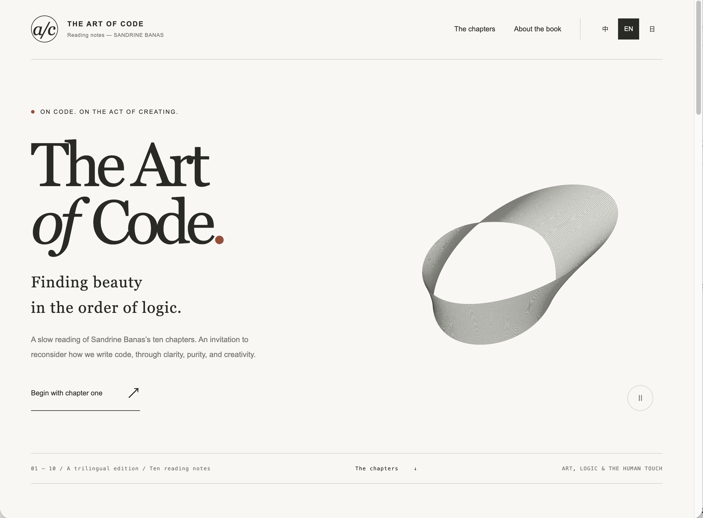
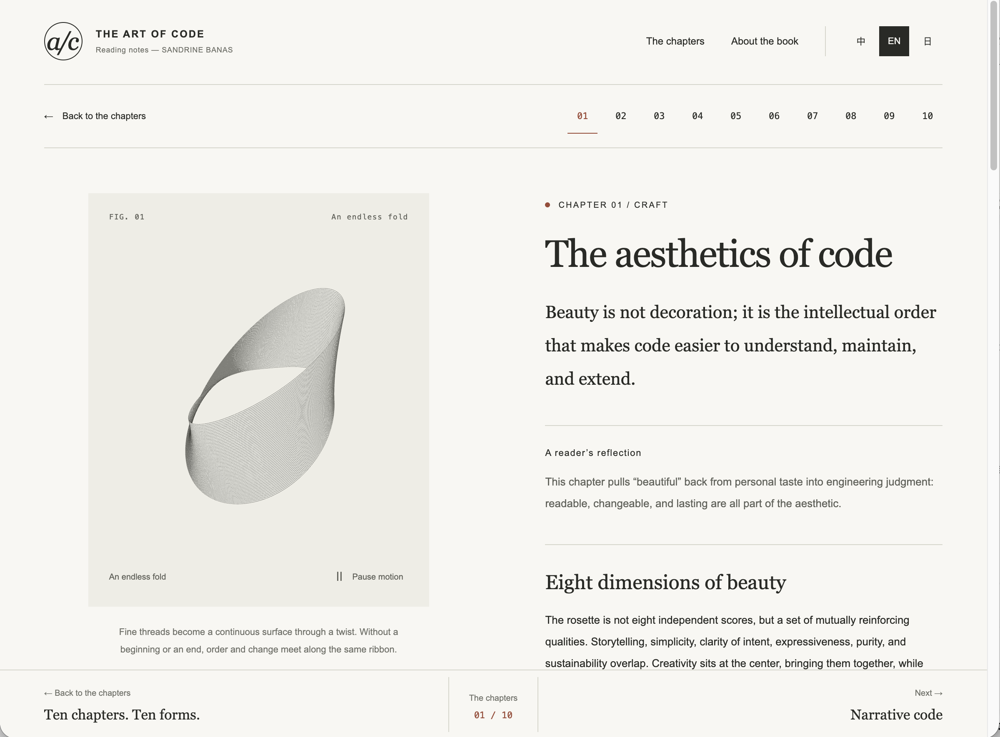

# The Art of Code — 読書ノート

[English](README.md) · [中文](README.zh-CN.md) · [日本語](README.ja.md)

> これは日本語版です。GitHub で最初に表示されるのは英語版 `README.md` です。

Sandrine Banas の *The Art of Code* のための中国語・英語・日本語による読書ノートサイトです。提供された十章の内容を、静かなデジタル読書室としてまとめました。編集的なリーディングページ、レスポンシブなナビゲーション、モノクロのアニメーションアート、そして第1章に登場する「美しいコードの八つの軸」の具体的な解説を備えています。

**公開サイト：** [yonglun.me/the-art-of-code](https://yonglun.me/the-art-of-code)

## スクリーンショット

### ホームページ



### 第1章



## 特徴

- 中国語、英語、日本語のインターフェースと章ノート。初回アクセスは英語がデフォルトです。
- 概要、読後の考察、三つの持ち帰り、編集による要約を含む十のリーディングページ。
- 第1章では、物語、シンプルさ、意図の明快さ、表現力、純粋さ、持続可能性、耐久性、創造性を実践例付きで解説します。
- 各章にオリジナルの Canvas アートを用意。ホームページと第1章は抽象的なメビウスの帯を共有し、他の章にはそれぞれ異なるパラメトリック構成を使っています。
- アートは表示中だけ動き、再生/一時停止、reduced-motion への対応、小さな画面での線密度調整を備えています。
- リーディングページの下部に前後の章とギャラリーへの固定ナビゲーションを配置し、モバイルのセーフエリアにも対応しています。
- 検索、テーマフィルター、章の地図、キーボードフォーカス、ローカルな読書進捗の保存に対応しています。

## ローカルで実行

```sh
npm install
npm run dev
```

Vite が表示するローカル URL を開いてください。本番ビルドは次のコマンドで作成できます。

```sh
npm run build
npm run preview
```

静的な Vite サイトです。章の URL は `#chapter/aesthetics` のようなフラグメントを使うため、サーバー側のルート書き換えは必要ありません。

## テスト

Node の回帰テストを実行します。

```sh
node --test tests/*.test.js
```

アートのジオメトリと動き、小さな Canvas の線密度、三言語の八つの軸のデータ、英語デフォルトのロケールを検証します。

## プロジェクト構成

```text
src/
├── App.jsx                    # アプリの外枠、URL、言語、進捗状態
├── content.js                 # 三言語の章ノートと八つの軸
├── siteCopy.js                # ローカライズされた UI とアートの文言
├── components/
│   ├── Artwork.jsx            # Canvas のライフサイクル、表示範囲、動き
│   ├── Gallery.jsx            # 章の地図、検索、フィルター
│   └── Reader.jsx             # 読書ページと八つの軸の解説
└── art/
    ├── drawings.js            # アートの振り分けと章ごとの構成
    └── mobius.js              # ホームページ/第1章の抽象的な帯
docs/assets/                   # README に使うスクリーンショット
tests/                         # Node の回帰テスト
```

## コンテンツと権利

読書ノートは、本プロジェクトに提供された十章のファイルをもとに編集しています。書籍の複製ではなく、独立した読書コンパニオンです。概要、感想、実践例、要約文は編集上の解釈であり、必要に応じてその旨を示しています。書籍情報は [Manning の The Art of Code](https://www.manning.com/books/the-art-of-code) を参照してください。

このプロジェクトは [MIT ライセンス](LICENSE) のもとで公開しています。
